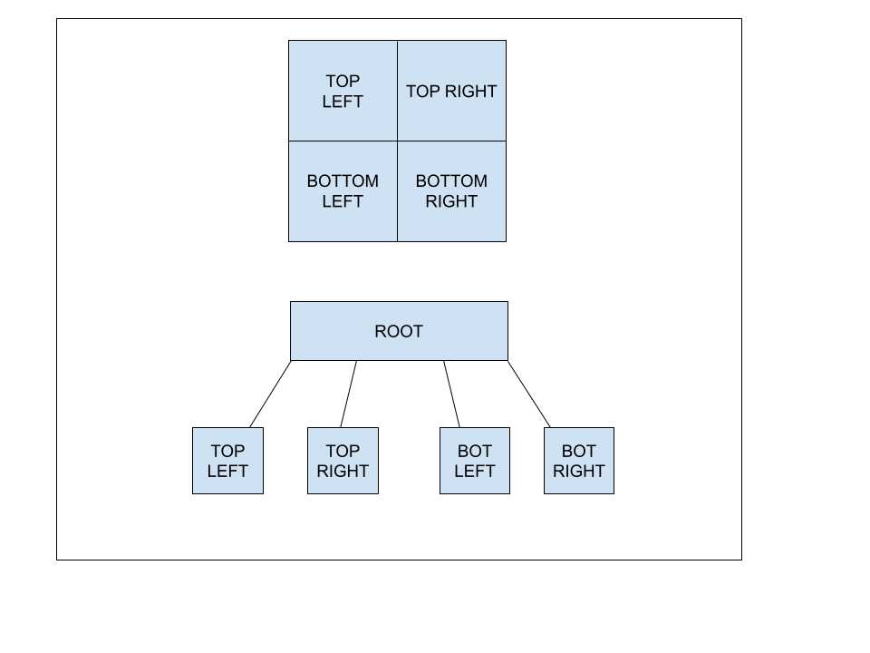
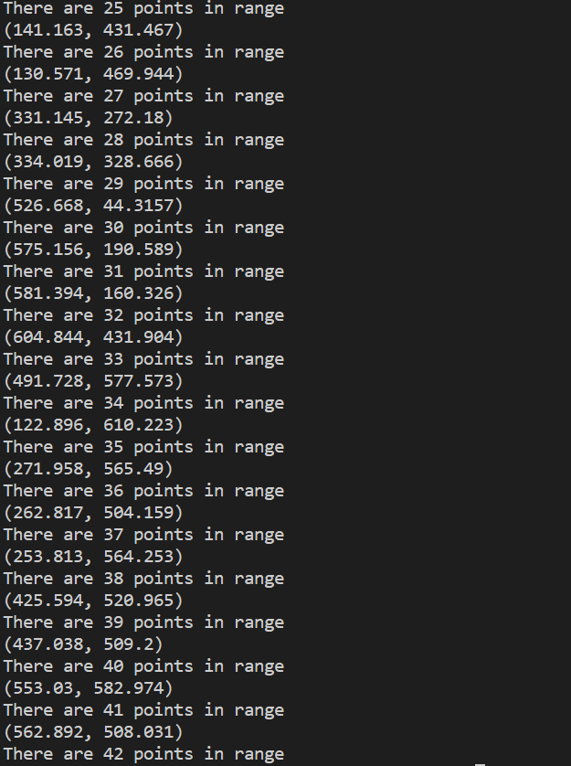

# CC2270 Project - Quadtree

## Walkthrough

For my CS2270 Data Structures Project I decided to explore and implement a quad tree. A quad tree is a type of data structure that can be especially helpful for spatial data. You can think of it as a tree where each node has 4 children and those children can each have 4 more children. This can continue recursively so that there are many “subdivisions” that give information such as location and spatial data. For this implementation, I am using a simple point to represent x and y coordinates of aa location. The best way to think about it is instead of visualizing a tree you can visualize a node as a square and it’s four children as the quadrants (top left, top right, bottom left, and bottom right). Here is an illustration of both the types with the common tree visualization shown below and the quadtree visuzliation shown below.

Each quadrant or child can then be subdivided into further children to efficiently store data but also to place it in its own location with respect to the root node. Because each node can only contain 4 children, once I add 4 points to a quadrant we `subdivide` to allow more points to be stored. This allows for efficient storage and retrieval of locations as well as a method to `query` points that are in a certain region. This is a generic explanation of what is going on so now I’ll be diving into the code and walking through it.   

The first challenge I faced was writing the `quadtree.h` and `quadtree.cpp` file into a similar structure that we had for homeworks. I found this was helpful by being able to reference previous homeworks and leveraging the work I did there. Once I was able to get the format how I liked, I started to work through the header file.  

First, I needed a type to store the `x` and `y` locations for each point being inserted into the quadtree. I did this using a simple struct called `Point` with float types storing the `x` and `y` coordinate variables.  

Next, I created the `QuadTreeNode` class which needed pointers to each quadrant, starting locations of the node (`node_x` and `node_y`), the `node_height` and `node_width` of the node, and a `capacity`. I also used a vector to store these points within each of the QuadTreeNodes. `node_height` and `node_width` variables don’t make a ton of sense when you visualize it as a tree, but using the depiction above and the test example, we can see that the `node_x` = 0 and `node_y` = 0, which is the starting point at the top left of the node. Then we can see that the node we are testing in `main.cpp` is 1000 units wide and 1000 units high. This is what gives us the ability to `subdivide` our nodes correctly but also to search for points within a range of values. Lastly the `capacity` is our check for when we need to subdivide a node. After reaching the capacity of 4 (4 children/4 quadrants) and the node has no children, the program then runs through its subdivide function on the correct node.  

With the `QuadTreeNode` created with a constructor, I implemented the `contains` function as this would be one of the first checks to see whether you would insert a point. A lot of the research I did on this type of data structure involved recursive calls. To check whether a quadrant or child contained said point, the `contains` function would need to run on each quadrant after a recursive call to the quadrant being looked in. This is why the contain function is placed at the beginning of the insert function with calls at the end of the insert function to `insert` into each different quadrant. Doing so lets the program check if the point being added belongs to a certain quadrant. This also only happens after the initial node has been subdivided because otherwise the contain function and the check for capacity have a return statement that exits the insert function.  

I talked a little about the `subdivide` and `contains` function in how they relate to the `insert` function. The rest of the function carries on recursively and will check if the point is within first the top left quadrant. If it is, then the `if` statement with contains does not return and it then checks if it within capacity as well as a leaf node. If it is not within capacity and a leaf node, then we `subdivide`. Our `subdivide` function essentially reassigns these new division as the quadrants/children of the quadtree node. Now when we run our recursive calls with `insert`, our `contains` function will check which quadrant it should be in and run the function on that quadrant. One of the keys to making the recursive portion work was including this contain check that would only insert if it found that the point being inserted was withing the bounds of the subdivided quadrants.  

The last function that was implemented was the `query` function. This is how we can query a certain range of values or in our case a certain region of the quadtree to see if our data exists there or not. Similar to our `insert` function, we use a Boolean function called `intersects` to check whether or not the node is within the range that we provide. If not, we return an empty vector. If so, we then add these points to a vector we call `pointsInRange`. Again we do another recursive call and this is really just to take advantage of our `intersects` function. If we are checking points in a node that is not a leaf node, then we need to make sure we are adding the points in range vector to the right node. We use an if statement that queries each quadrant and if the range contains the node, we then add the points that were queried to our `pointsInRange` vector.  

## Debugging

One part that was debugged was my initial subdivision in my `insert` function. Because the first root node gets subdivided, we need to take the initial points that were added before we subdivided and add them to the correct quadrant. We do this by making a recursive call to each of the quadrants that were initialized to see if it contains the data. If it does, we exit the loop there with a `continue` statement so we don’t have to check the other quadrants. Initially, I did not have anything below the `subdivide` function being called out in `insert` and this led to some incorrect data.  

## Testing, Improvements, and Application

So to sum it up, we have created a tree structure that is able to spatially represent locations of data points and are also able to now select an area of the tree and return the data found within. Having the data within a tree structure can be very efficient for searching for said data and also can be applied to filtering out data by spatial location.   

For testing my implementation, I mainly used the `main.cpp` program to insert values and see whether that agreed with what I expected. The first values added were simple user defined values such as `Point p = {10,10}`. This was mostly to make sure my code was functioning how I expected as well as to test the different ways to call out variables. After testing with user defined values, I then decided it would be more applicable to use some type of random generator. My thought was that I could simulate events on a map like sightings of a certain animal. This data could then be queried by selecting a certain region on a map to tell you how many sightings there would be. I initially was interesting in trying to find an application for video games and they are widely used for collision detection and bullet tracing, but found it to be a little complicated for my skills. Still, I think applying it to real world gps data would be another interesting real world application. One of the improvements I think I could make would be to allow for importing of CSV values. This would open up it’s user base and allow for different types of data to be entered instead of just random point locations. ANother imrpovement I could make is making sure that the inputs are always within bounds, this may be more for when entering user defined properties but is something that could be beneficial.  

Overall I had fun implementing this project and seeing a similar data structure to the ones we did in our classwork. I thought the familiarity made it much less intimidating as well as give me some reference material to go off of. Here are some screenshots showing the print statements after inserting 100 random points into the quadtree. These print statements show the points that are in range of the input in `main.cpp` as well as counts how many points are within the `pointInRange` vector.

